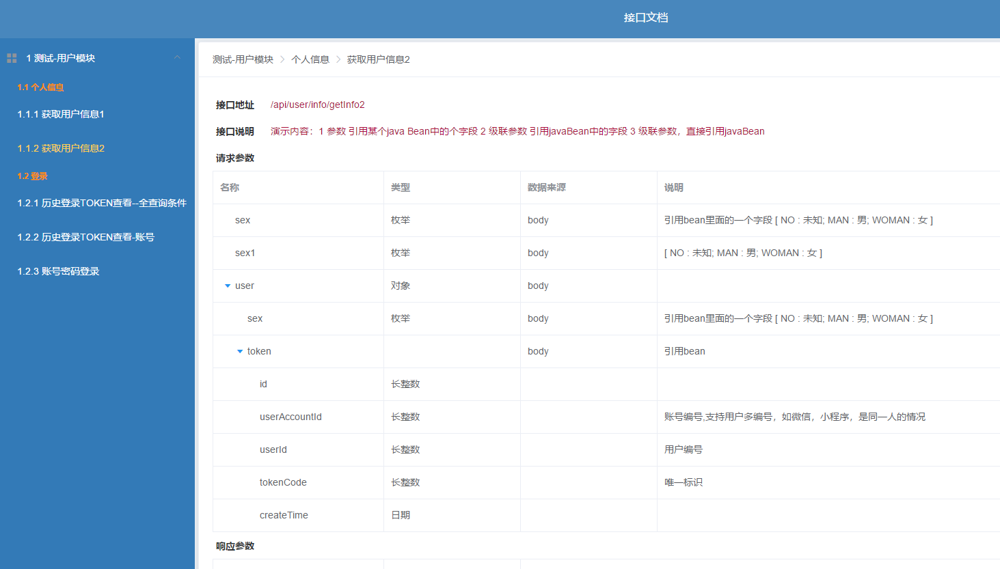

>启动之前分析了swagger2，功能非常非常强大，比较偏向于rest风格，但不太满足公司项目的需求：
- 1 code通过http status来表示，而不是在response body 的json中标识
- 2 rest要求并期望用户定义实体，而项目中往往一个参数只有一个id和name，参数太少不太愿意构建实体
- 3 如果不定义实体，无法描述再swagger的ApiParam中描述{name:李老师,address:{city:,prov:}}结构信息
- 4 请求和返回格式，是需要添加共同的json格式，数据只是在json的data中传递，如{code:0,message:"",data{}};


>设计初衷是简单，适合项目需求的api辅助工具，大致如下：
- 1 在开发一个接口时，通过注解方式将接口信息添加在接口上
- 2 通过一个web模块，查询出所有api的json格式的描述数据
- 3 通过ui在展示json的数据，供前端人员使用

> 由于人力投入有限，目前只提供了html方式查看，spring mvc的接口开发。
功能目前还不是很全面，但比较适合我们公司的大部分项目使用场景和方式。


没有最好的框架，只有最适合的。如果你觉得用得顺手，并希望优化下去，欢迎加入..

>使用方式 

 (```)
     
    @RestController
    @RequestMapping("/api/user/info")
    @Api(value = "登录", tags = "演示", module = "测试-用户模块")
    public class LoginController {
    
    
        @ApiMethod(value = "账号密码登录", note = "演示内容： 单个参数，不需要创建VO/DTO 类", params = {@ApiParam(value = "account", note = "账号")
                , @ApiParam("password")})
        @PostMapping(value = "/loginByPassword")
        public ResultEntity<UserToken> loginByPassword(@RequestBody JSONObject jsonObject) throws Exception {
            return ResultEntity.success();
        }
    
        @ApiMethod(value = "历史登录TOKEN查看-账号", note = "演示内容：1 参数对象级联关系 2 参数类型 3 分页类型递归处理，即多级泛型 4 返回为数组",
                params = {@ApiParam(value = "user.name"), @ApiParam("user.account")
                        , @ApiParam(value = "startTime", type = Date.class)})
        @PostMapping(value = "/selectPageBean")
        public ResultEntity<IPageBean<UserToken>> selectPageBean(@RequestBody JSONObject jsonObject) throws Exception {
            return ResultEntity.success();
        }
        
        @ApiMethod(value = "历史登录TOKEN查看--全查询条件", note = "演示内容：1 可以手动指定DTO/VO 类（paramType），2 进行参数的补充 3 参数为泛型时的支持 4 返回类型的补充"
                , paramType = UserInfo.class
                ,params = {@ApiParam(value = "team.id", note = "所属团队id，这是补充的一个参数"), @ApiParam(value = "team.status", type = UserStatus.class, note = "团队状态")}
                ,result = {@ApiParam(value = "data.sysCode", note = "当XXX情况下，存在（补充说明）")})
        @PostMapping(value = "/selectPageBeanAll")
        public ResultEntity<IPageBean<UserToken>> selectPageBeanAll(@RequestBody JSONObject jsonObject) throws Exception {
            return ResultEntity.success();
        } 
    }
 (```) 
 
 (```) 
        
    @RestController
    @RequestMapping("/api/user/info")
    @Api(value = "个人信息", tags = "演示", module = "测试-用户模块")
    public class UserController {
    
        @ApiMethod(value = "获取用户信息1", note = "演示内容：1 参数数组 2 级联数组 3 属性对象引用描述（如leader字段）4 返回数组", params = {
                @ApiParam(value = "money", type = double.class)
                , @ApiParam("user.name"), @ApiParam("user.score[].name"), @ApiParam("user.score[].value")
                , @ApiParam(value = "user.imgs[]", note = "图片地址")
                , @ApiParam(value = "user.leader", type = UserInfo.class)})
        @PostMapping(value = "/getInfo1")
        public ResultEntity<Long[]> getInfo1(@RequestBody JSONObject jsonObject) throws Exception {
            return ResultEntity.success();
        }
    
        @ApiMethod(value = "获取用户信息2", note = "演示内容：1 参数 引用某个java Bean中的个字段 2 级联参数 引用javaBean中的字段 3 级联参数，直接引用javaBean"
                , params = {@ApiParam(value = "$sex", type = UserInfo.class, note = "引用bean里面的一个字段")
                , @ApiParam(value = "sex1 ", type = UserSex.class)
                , @ApiParam(value = "user.$sex", type = UserInfo.class, note = "引用bean里面的一个字段")
                , @ApiParam(value = "user.token", type = UserToken.class, note = "引用bean里面的一个字段")})
        @PostMapping(value = "/getInfo2")
        public ResultEntity<Long[]> getInfo2(@RequestBody JSONObject jsonObject) throws Exception {
            return ResultEntity.success();
        }
    
    }
 (```) 
 
 
>效果





